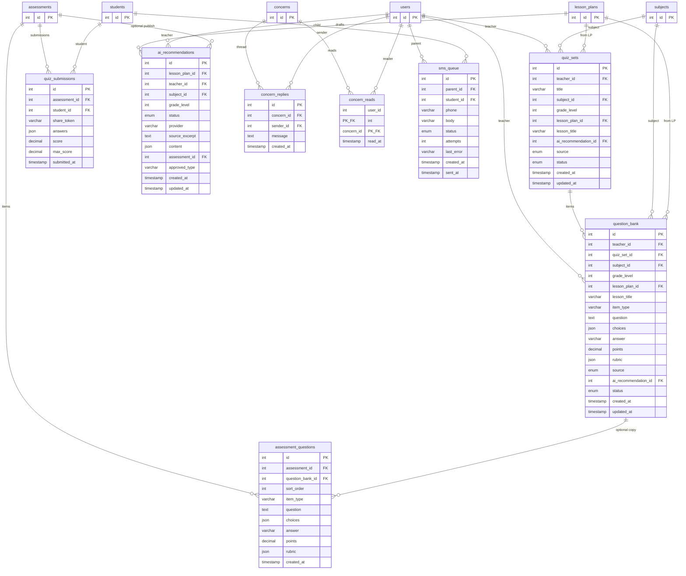

# ConnectED live ERD

This matches the **running** schema (original dump plus startup `ALTER` / `CREATE TABLE IF NOT EXISTS`). Parent **Progress Summary** is not a table; it is computed from `attendance` and `assessment_scores`.

The older 15-table diagram is still the core. Add the extra columns on `attendance` / `assessments` / `assessment_scores`, and the classwork–quiz–SMS tables below.

---

## Core (accounts, school, inbox, records)

```mermaid
erDiagram
  users {
    int id PK
    varchar first_name
    varchar last_name
    varchar email
    varchar password_hash
    varchar phone
    enum role
    enum STATUS
    tinyint must_change_password
    varchar avatar_url
    timestamp created_at
  }

  students {
    int id PK
    varchar lrn
    varchar first_name
    varchar middle_name
    varchar last_name
    int grade_level
    varchar section
    date dob
    enum gender
    enum STATUS
    timestamp created_at
  }

  parent_profiles {
    int id PK
    int user_id FK
    text address
    varchar emergency_contact
  }

  parent_student_links {
    int id PK
    int parent_id FK
    int student_id FK
    timestamp created_at
  }

  teacher_profiles {
    int id PK
    int user_id FK
    enum teaching_mode
    int homeroom_grade
    varchar homeroom_section
    varchar specialization
    json subjects_taught
    json grades_handled
  }

  subjects {
    int id PK
    varchar CODE
    varchar NAME
    text description
    varchar applicable_grades
  }

  teacher_assignments {
    int id PK
    int teacher_id FK
    int subject_id FK
    int grade_level
    varchar section
    varchar school_year
  }

  lesson_plans {
    int id PK
    varchar title
    int subject_id FK
    int grade_level
    text objectives
    varchar file_path
    int uploaded_by FK
    timestamp created_at
  }

  assessments {
    int id PK
    varchar title
    enum TYPE
    int subject_id FK
    int grade_level
    varchar section
    int max_score
    varchar quarter
    varchar quiz_link
    varchar share_token
    tinyint share_enabled
    date quiz_attendance_date
    varchar quiz_attendance_session
    int quiz_subject_id
    json quiz_makeup_student_ids
    datetime quiz_closes_at
    datetime quiz_makeup_closes_at
    int created_by FK
    timestamp created_at
  }

  assessment_scores {
    int id PK
    int assessment_id FK
    int student_id FK
    decimal score
    json rubric_scores
    timestamp recorded_at
  }

  attendance {
    int id PK
    int student_id FK
    date DATE
    enum session
    int subject_id FK
    int subject_key
    enum STATUS
    int recorded_by FK
    timestamp created_at
  }

  announcements {
    int id PK
    varchar title
    text content
    text body
    int sender_id FK
    enum scope
    int target_grade
    varchar target_section
    enum audience
    enum priority
    int admin_id FK
    timestamp created_at
    timestamp updated_at
  }

  announcement_reads {
    int user_id PK_FK
    int announcement_id PK_FK
    timestamp read_at
  }

  messages {
    int id PK
    int sender_id FK
    int receiver_id FK
    int student_id FK
    varchar SUBJECT
    text message
    enum category
    tinyint is_read
    timestamp created_at
  }

  concerns {
    int id PK
    int parent_id FK
    int teacher_id FK
    int student_id FK
    varchar SUBJECT
    text message
    enum STATUS
    enum priority
    text teacher_reply
    timestamp replied_at
    timestamp created_at
    timestamp updated_at
  }

  activity_log {
    int id PK
    int user_id FK
    varchar user_name
    varchar user_role
    varchar ACTION
    varchar target_type
    varchar target_name
    text details
    timestamp created_at
  }

  app_settings {
    varchar setting_key PK
    varchar setting_value
    timestamp updated_at
  }

  users ||--o{ parent_profiles : "parent"
  users ||--o{ teacher_profiles : "teacher"
  users ||--o{ parent_student_links : "parent_id"
  students ||--o{ parent_student_links : "student_id"
  users ||--o{ teacher_assignments : "teacher_id"
  subjects ||--o{ teacher_assignments : "subject_id"
  subjects ||--o{ lesson_plans : "subject"
  users ||--o{ lesson_plans : "uploaded_by"
  subjects ||--o{ assessments : "subject"
  users ||--o{ assessments : "created_by"
  assessments ||--o{ assessment_scores : "scores"
  students ||--o{ assessment_scores : "student"
  students ||--o{ attendance : "marks"
  subjects ||--o{ attendance : "optional subject"
  users ||--o{ attendance : "recorded_by"
  users ||--o{ announcements : "sender"
  announcements ||--o{ announcement_reads : "reads"
  users ||--o{ announcement_reads : "reader"
  users ||--o{ messages : "sender"
  users ||--o{ messages : "receiver"
  students ||--o{ messages : "about"
  users ||--o{ concerns : "parent"
  users ||--o{ concerns : "teacher"
  students ||--o{ concerns : "about"
  users ||--o{ activity_log : "actor"
```

Unique attendance slot: `(student_id, DATE, session, subject_key)` where `subject_key = IFNULL(subject_id, 0)`. `STATUS` includes Present, Absent, Late, Excused. `teacher_profiles.teaching_mode` includes homeroom, subject, class_adviser, subject_teacher, both.

---

## Classwork, quiz share, inbox thread, SMS

Paste either Mermaid block into [mermaid.live](https://mermaid.live) or a Markdown preview to export PNG/SVG for the paper.